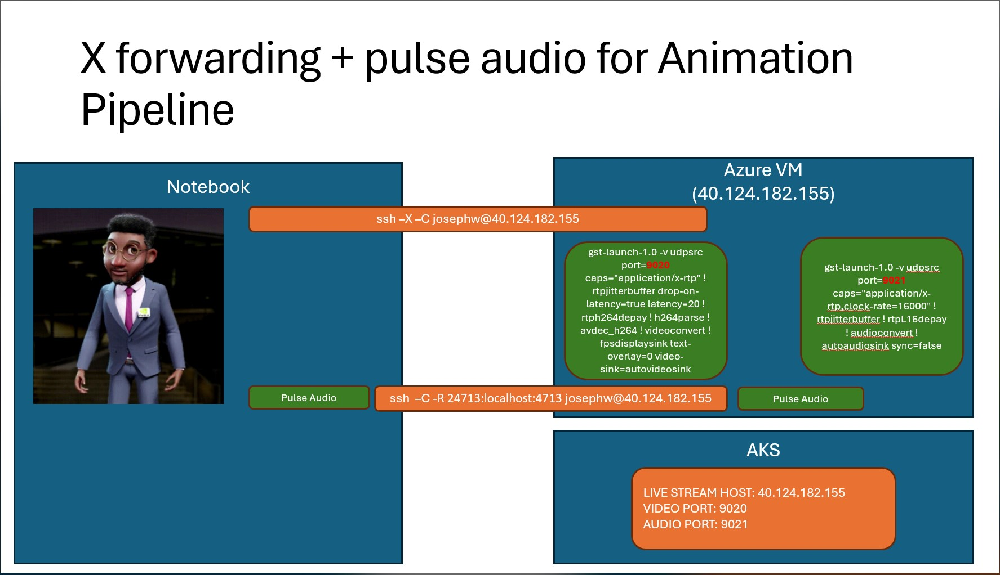
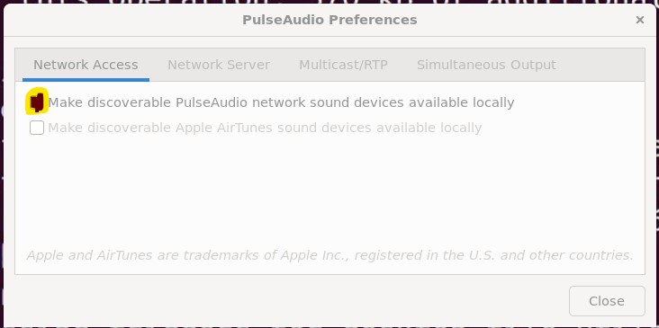
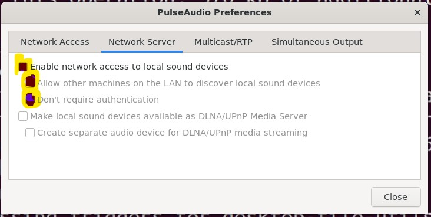

# NVidia ACE - Animation Pipeline on Azure

[NVidia documentation](https://docs.nvidia.com/ace/latest/workflows/animation_pipeline/index.html) do a good job,  It eplains how to install it quite clearly.  We will just suppliment several Azure specific points below. 


## Instance consideration

- Animation Pipeline need video encoder.  which is not in V100, A100, H100 GPU.  The current available choices are T4, A10.  We recommend A10 GPU.
- We recomment skip driver installation in our [AKS](../../aks/README.md) document. But A10 is vGPU drive it need extra step to make GPU operator install vGPU driver properly, [This document](https://docs.nvidia.com/datacenter/cloud-native/gpu-operator/latest/install-gpu-operator-vgpu.html) provide the detail instruction.  But you can not skip driver installation at node pool creation for now.

## config modification

- remove render-b.  The original document will deploy 2 avatars run on gpu0 and gpu1. But in AKS case.  we have multiple gpu in multiple node and they are all gpu0.  you can fix it. but easiest part is just remove avatar b from both Chart.yaml and values.yaml under ~/ACE/workflows/animation_pipeline/deploy/_build/animation_pipeline/
- point to remote server.  you need to provide remote client ip address in values.yaml.  there are two places
```


          - name: IAORMS_ANIMATION_SOURCE_BUFFER_SIZE
            value: '0.1'
          - name: IAORMS_RTP_NEGOTIATION_HOST_MOCKING_ENABLED
            value: 'True'
          - name: IAORMS_LIVESTREAM_HOST
            value: <ip of remote client, ip of machine will run gstreamer>
          - name: IAORMS_LIVESTREAM_VIDEO_PORT
            value: '9020'
          - name: IAORMS_LIVESTREAM_VIDEO_BIT_RATE
            value: '4000000'
  ...

  - name: ngc-docker-reg-secret
  livestream:
    host: <ip of remote client, ip of machine will run gstreamer>
    rtpNegotiationHostMockingEnabled: true

```

## Connection consideration

ACE server will try to reach gstreamer player at client.  This may cause some issue.  Let's discuss this case by case

### Azure Stack HCI Case

This is the easiest case.  Client and server are close and no firewall in between.  It will just work after deployment.

### Server at cloud and client at home

Even there is firewall in between but the router is under your control.  You just need to open the port forwarding from your router. please refer your wifi router, cable modem document to perform this 

### Server at cloud and client at edge but not at home

We will put the client at cloud and pull the AV stream to local.

#### Ubuntu



- We create a remote Ubuntu client and local Ubuntu client,  output is at remote client and we pull it over to client.
- We use pulse audio to pull audio over to the network via a ssh tunnel.
  [This link](https://www.youtube.com/watch?v=Lsgaz5s5hfs&amp;ab_channel=Abstractprogrammer) explain how to setup remote speaker.
- install pulse audio in both remote client and local client anf reboot
```
sudo apt install paprefs
# fix the pulse audio symbolic link
ls /usr/lib | greppulse
pulse-15.99.1+dfsg1
# sudo ln -s /usr/lib/pulse-15.99.1+dfsg1 /usr/lib/pulse-15.99
```
- using paprefs command to confige remote client as pulse audio client, config local client as pulse audio server
```
# from remote client
paprefs
```

```
#from local client
paprefs
```

- we use -X -C flags to pull images over to the network.
```
ssh -X -C azureuser@<remote client IP>
gst-launch-1.0 -v udpsrc port=9020 caps="application/x-rtp" ! rtpjitterbuffer drop-on-latency=true latency=20 ! rtph264depay ! h264parse ! avdec_h264 ! videoconvert ! queue ! autovideosink sync=false
```
- we use -R -C flags to pull audio over to the network.
```
ssh -C -R 24713:localhost:4713 azureuser@<remote client IP>
export PULSE_SERVER="tcp:localhost:24713"
gst-launch-1.0 -v udpsrc port=9021 caps="application/x-rtp,clock-rate=16000" ! rtpjitterbuffer ! rtpL16depay ! audioconvert ! autoaudiosink sync=false
```

#### Windows 11

Pulse Audio not work well on Windows and WSL.  We can use RDP to pull A/V over
The original document just explain how to install gstreamer on Ubuntu.  Following is how to install gstreamer in Windows
All you need is just to download runtime installer msi and development installer msi from https://gstreamer.freedesktop.org/download/#windows and run it
But you better choose custom installation and install all package.  You will get some component not found if you use typical installation.

and the command to run audio in Windows is different from the command in Ubuntu.
```
gst-launch-1.0 -v udpsrc port=9021 caps="application/x-rtp,clock-rate=16000" ! rtpjitterbuffer ! rtpL16depay ! audioconvert ! directsoundsink sync=false
```


