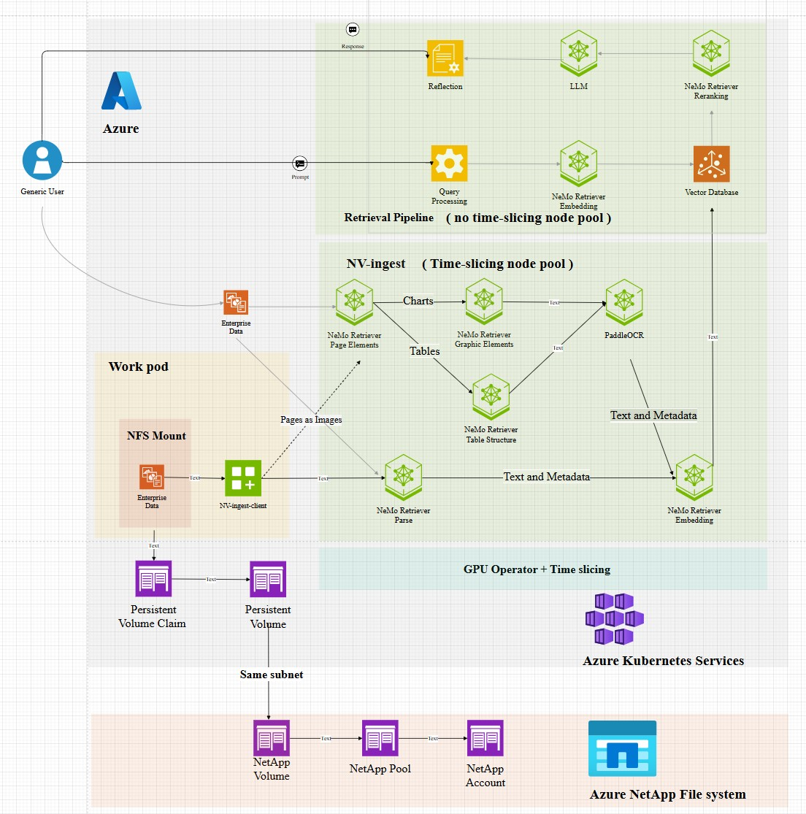

# Get Started With NVIDIA RAG Blueprint

Official instructions document can be forund [here](https://github.com/NVIDIA-AI-Blueprints/rag/blob/main/docs/quickstart.md#deploy-with-helm-chart)

## Architecture

## Create 2 GPU nodepools

- frontend - 2x nodes, 4x GPUs (aks-gpunp2h100-03571910-vmss000002, aks-gpunp2h100-03571910-vmss000003)
- backend - 1X node, 1x GPUs (aks-gpunp1h100-34045329-vmss000002)time-slicing to 6


## 

### Export NGC API Key

```
export NGC_API_KEY="your_ngc_api_key"
export NVIDIA_API_KEY="nvapi-*"
```

### Verify that you have a default storage class available in the cluster for PVC provisioning. 

```
kubectl apply -f https://raw.githubusercontent.com/rancher/local-path-provisioner/v0.0.26/deploy/local-path-storage.yaml
kubectl get pods -n local-path-storage
kubectl get storageclass
```

### If the local path storage class is not set as default, it can be made default by using the following command.

```
kubectl patch storageclass local-path -p '{"metadata": {"annotations":{"storageclass.kubernetes.io/is-default-class":"true"}}}'
```

### Add NVIDIA Helm Repositories

```
helm repo add nvidia-nim https://helm.ngc.nvidia.com/nim/nvidia/ --username='$oauthtoken' --password=$NGC_API_KEY
helm repo add nim https://helm.ngc.nvidia.com/nim/ --username='$oauthtoken' --password=$NGC_API_KEY
helm repo add nemo-microservices https://helm.ngc.nvidia.com/nvidia/nemo-microservices --username='$oauthtoken' --password=$NGC_API_KEY
helm repo add baidu-nim https://helm.ngc.nvidia.com/nim/baidu --username='$oauthtoken' --password=$NGC_API_KEY
```

### Update Helm Repositories

```
helm repo update
```

```
git clone https://github.com/NVIDIA-AI-Blueprints/rag.git
cd deploy/helm/
```

### Update Dependencies for RAG Server

```
helm dependency update rag-server/charts/ingestor-server
helm dependency update rag-server
```
### Assign pods to proper nodepool

#### for backend
```
rm -rf ingestor-server
tar -xvf ingestor-server-v2.0.0.tgz
rm ingestor-server-v2.0.0.tgz
```
 - rag-server/charts/ingestor-server/charts/nv-ingest/charts/milvus/values.yaml
 - rag-server/charts/ingestor-server/charts/nv-ingest/charts/nvidia-nim-paddleocr/values.yaml
 - rag-server/charts/ingestor-server/charts/nv-ingest/charts/nvidia-nim-nemoretriever-page-elements-v2/values.yaml
 - rag-server/charts/ingestor-server/charts/nv-ingest/charts/nvidia-nim-nemoretriever-graphic-elements-v1/values.yaml
 - rag-server/charts/ingestor-server/charts/nv-ingest/charts/nvidia-nim-nemoretriever-table-structure-v1/values.yaml

```
# change 
# nodeSelector: {}  # likely best to set this to `nvidia.com/gpu.present: "true"` depending on cluster setup
# into
# nodeSelector:
#   nvidia.com/gpu.sharing-strategy: "notime-slicingne"
```
#### for frontend
```
tar -xvf nvidia-nim-llama-32-nv-embedqa-1b-v2-1.5.0.tgz
rm nvidia-nim-llama-32-nv-embedqa-1b-v2-1.5.0.tgz
tar -xvf text-reranking-nim-1.3.0.tgz
rm text-reranking-nim-1.3.0.tgz
```
- rag-server/charts/nvidia-nim-llama-32-nv-embedqa-1b-v2/values.yaml
- rag-server/charts/text-reranking-nim/values.yaml
```
# change 
# nodeSelector: {}  # likely best to set this to `nvidia.com/gpu.present: "true"` depending on cluster setup
# into
# nodeSelector:
#   kubernetes.io/hostname: "aks-gpunp2h100-03571910-vmss000002"
``` 
```
tar -xvf nim-llm-1.3.0.tgz
rm nim-llm-1.3.0.tgz
```
- rag-server/charts/nim-llm/values.yaml
```
# change 
# nodeSelector: {}  # likely best to set this to `nvidia.com/gpu.present: "true"` depending on cluster setup
# into
# nodeSelector:
#   kubernetes.io/hostname: "aks-gpunp2h100-03571910-vmss000003"
```

### Create a namespace for the deployment:

```
kubectl create namespace rag
```

### Deploying End to End RAG Server + Ingestor Server (NV-Ingest)

```
helm install rag -n rag rag-server/ \
--set imagePullSecret.password=$NVIDIA_API_KEY \
--set ngcApiSecret.password=$NVIDIA_API_KEY
```

### Port forwarding for UI
```
kubectl port-forward -n rag service/rag-frontend 3000:3000 --address 0.0.0.0
```
