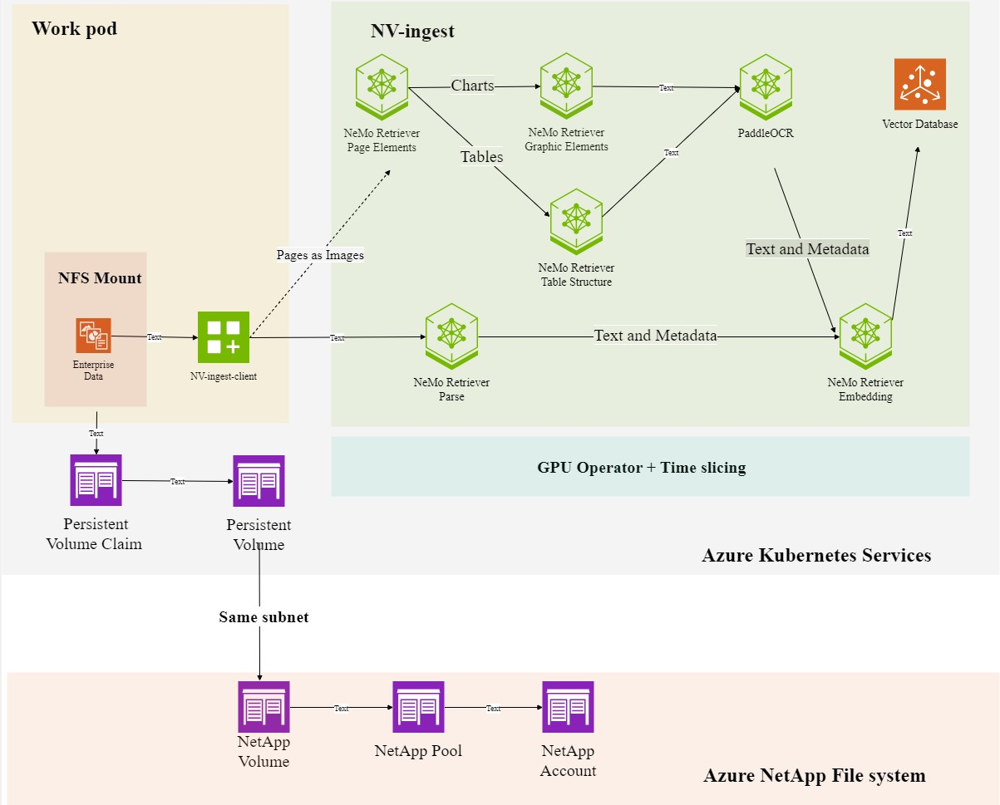

# NeMo Retriever Extraction (also known as nv-ingest)

## Architecture Diagrame



## Prerequisites

Please follow [Pre-rquirement instruction](./prerequisites/README.md) to get ready for AKS creation.
Also reference https://docs.nvidia.com/nemo/retriever/extraction/support-matrix/ for NeMo Retriever Extraction requirement.

## Create AKS

Please follow [Create AKS instruction](./setup/README.md) to create AKS.
And two spectial Notes
 - NeMo Retriever Extraction need 6 GPUs but you can run it in single GPU with the help of Time slicing configMap for gpu operator
 - Please add --enable-ultra-ssd --max-pods 110 --zones flags when you create gpu nodepool.

###  Install Time-slicing ConfigMap (Optional)

Find the GPU nodes want to apply time slicing
```
kubectl get nodes -o wide
```
Verify node labels before time-slicing (Optional)
```
kubectl get node <node name> -o json | jq '.metadata.labels | to_entries | map(select(.key | startswith("nvidia.com/gpu"))) | from_entries'
```
Create Configmap
```
cat << EOF > time-slicing-config-fine.yaml
apiVersion: v1
kind: ConfigMap
metadata:
  name: time-slicing-config-fine
data:
  a100-80gb: |-
    version: v1
    flags:
      migStrategy: none
    sharing:
      timeSlicing:
        resources:
        - name: nvidia.com/gpu
          replicas: 6
EOF
```
Apple Configmap
```
kubectl create -n gpu-operator -f time-slicing-config-fine.yaml
```
Verify Creation of ConfigMap (Optional)
```
kubectl get configmap -n gpu-operator time-slicing-config-fine
```
Configure the device plugin with the config map and set the default time-slicing configuration
```
kubectl patch clusterpolicies.nvidia.com/cluster-policy \
    -n gpu-operator --type merge \
    -p '{"spec": {"devicePlugin": {"config": {"name": "time-slicing-config-fine"}}}}'
```
Confirm that the gpu-feature-discovery and nvidia-device-plugin-daemonset pod restart (Optional)
```
kubectl get events -n gpu-operator --sort-by='.lastTimestamp'
```
Label Nodes for Time-slicing Configs tp Take Effect
```
kubectl label node \
    --selector=nvidia.com/gpu.product=NVIDIA-A100-SXM4-80GB \
    nvidia.com/device-plugin.config=a100-80gb
```
Observe changes to node label (Optional)
```
kubectl get node minikube -o json | jq '.metadata.labels | to_entries | map(select(.key | startswith("nvidia.com/gpu"))) | from_entries'
```
#### Change slicing 
Following is the steps to change replica from 6 to 2
```
# edit the configmape and change replica from 6 to 2
kubectl edit ConfigMap -n gpu-operator time-slicing-config-fine
kubectl label node --overwrite aks-gpunp2-39139343-vmss000004 nvidia.com/gpu.replicas=2
kubectl rollout restart -n gpu-operator daemonset/nvidia-device-plugin-daemonset
```
### Create NetApp NFS Mount
Please follow [Create NetApp Files for AKS](https://learn.microsoft.com/en-us/azure/aks/azure-netapp-files) to create NFS mount.

#### Configure Azure NetApp Files for AKS workloads

```
az provider register --namespace Microsoft.NetApp --wait
```
```
az netappfiles account create --resource-group $RESOURCE_GROUP --location $LOCATION --account-name $ANF_ACCOUNT_NAME
```
```
az netappfiles pool create --resource-group $RESOURCE_GROUP --location $LOCATION --account-name $ANF_ACCOUNT_NAME --pool-name $POOL_NAME --size $SIZE --service-level $SERVICE_LEVEL
```
```
az network vnet subnet create --resource-group $RESOURCE_GROUP --vnet-name $VNET_NAME --name $SUBNET_NAME --delegations "Microsoft.Netapp/volumes" --address-prefixes $ADDRESS_PREFIX
```
#### Create an NFS volume

```
az netappfiles volume create --resource-group $RESOURCE_GROUP --location $LOCATION --account-name $ANF_ACCOUNT_NAME --pool-name $POOL_NAME --name "$VOLUME_NAME" --service-level $SERVICE_LEVEL --vnet $VNET_ID --subnet $SUBNET_ID --usage-threshold $VOLUME_SIZE_GIB --file-path $UNIQUE_FILE_PATH --protocol-types NFSv3
```

```
az netappfiles volume show --resource-group $RESOURCE_GROUP --account-name $ANF_ACCOUNT_NAME --pool-name $POOL_NAME --volume-name "$VOLUME_NAME -o JSON
```
create pv-nfs.yaml
```
apiVersion: v1
kind: PersistentVolume
metadata:
  name: pv-nfs
spec:
  capacity:
    storage: 100Gi
  accessModes:
    - ReadWriteMany
  mountOptions:
    - vers=3
  nfs:
    server: 10.0.0.4
    path: /myfilepath2
```
```
kubectl apply -f pv-nfs.yaml
```
create pvc-nfs.yaml
```
apiVersion: v1
kind: PersistentVolumeClaim
metadata:
  name: pvc-nfs
spec:
  accessModes:
    - ReadWriteMany
  storageClassName: ""
  resources:
    requests:
      storage: 100Gi
```
```
kubectl apply -f pvc-nfs.yaml
```
## Deploy NeMo Retriever Extraction
```
NAMESPACE=nv-ingest
kubectl create namespace ${NAMESPACE}
# Nvidia nemo-microservices NGC repository
helm repo add nemo-microservices https://helm.ngc.nvidia.com/nvidia/nemo-microservices --username='$oauthtoken' --password=<NGC_API_KEY>

# Nvidia NIM NGC repository
helm repo add nvidia-nim https://helm.ngc.nvidia.com/nim/nvidia --username='$oauthtoken' --password=<NGC_API_KEY>

# Nvidia NIM baidu NGC repository
helm repo add baidu-nim https://helm.ngc.nvidia.com/nim/baidu --username='$oauthtoken' --password=<YOUR API KEY>

helm upgrade \
    --install \
    nv-ingest \
    https://helm.ngc.nvidia.com/nvidia/nemo-microservices/charts/nv-ingest-25.9.0.tgz \
    -n ${NAMESPACE} \
    --username '$oauthtoken' \
    --password "${NGC_API_KEY}" \
    --set ngcImagePullSecret.create=true \
    --set ngcImagePullSecret.password="${NGC_API_KEY}" \
    --set ngcApiSecret.create=true \
    --set ngcApiSecret.password="${NGC_API_KEY}" \
    --set paddleocr-nim.deployed=false \
    --set nemoretriever-ocr.deployed=true \
    --set envVars.OCR_MODEL_NAME="scene_text_ensemble" \
    --set redis.image.repository=bitnamilegacy/redis \
    --set redis.image.tag=8.2.1-debian-12-r0 \
    --set image.repository="nvcr.io/nvidia/nemo-microservices/nv-ingest" \
    --set image.tag="25.9.0"


helm upgrade \
    --install \
    nv-ingest \
  https://helm.ngc.nvidia.com/nvidia/nemo-microservices/charts/nv-ingest-25.9.0.tgz \
  -n nv-ingest \
  --username '$oauthtoken' \
  --password "${NGC_API_KEY}" \
  --set ngcImagePullSecret.create=true \
  --set ngcImagePullSecret.password="${NGC_API_KEY}" \
  --set ngcApiSecret.create=true \
  --set ngcApiSecret.password="${NGC_API_KEY}" \
  --set nemoretriever-ocr.deployed=true \
  --set nemoretriever-ocr.image.repository="nvcr.io/nvstaging/nim/nemoretriever-ocr-v1" \
  --set nemoretriever-ocr.image.tag="1.2.0-rc2-latest-release-38498041" \
  --set paddleocr-nim.deployed=false \
  --set envVars.OCR_MODEL_NAME="scene_text_ensemble" \
  --set image.repository="nvcr.io/nvidia/nemo-microservices/nv-ingest" \
  --set image.tag="25.9.0" \
  --set redis.image.repository=bitnamilegacy/redis \
  --set redis.image.tag=8.2.1-debian-12-r0 \
  --wait --timeout 30m    
```

## Test NeMo Retriever Extraction

### Test Data

- https://github.com/NVIDIA-AI-Blueprints/rag/tree/v2.0.0/data
- https://confluence.nvidia.com/pages/viewpage.action?pageId=3750958982

### Setup test pod
create nv-ingest-test.yaml
```
kind: Pod
apiVersion: v1
metadata:
  name: nv-ingest-test
spec:
  containers:
  - image: ubuntu
    name: nv-ingest-test
    command:
    - "/bin/sh"
    - "-c"
    - while true; do echo $(date) >> /mnt/azure/outfile; sleep 1; done
    volumeMounts:
    - name: disk01
      mountPath: /mnt/azure
  volumes:
  - name: disk01
    persistentVolumeClaim:
      claimName: pvc-nfs
```
```
kubectl exec -it nv-ingest-test --- bash
apt-get update
apt-get install python3-pip
pip install nv-ingest-client --break-system-packages
pip install pymilvus --break-system-packages
pip install pymilvus[bulk_writer] --break-system-packages
pip install pymilvus[model] --break-system-packages
pip install tritonclient --break-system-packages
```
Copy test data you want to test into pod
```
kubectl cp <your test data folder> nv-ingest-test:~
```
Find the nv-ingest cluster ip from the following command
```
kubectl get svc -n nv-ingest
```
Go to the test pod and go to the test data folder and run the following command
```
nv-ingest-cli   --doc "./*.pdf"  --output_directory ./processed_docs   --task='extract:{"document_type": "pdf", "extract_text": true, "extract_images": true, "extract_tables": true, "extract_charts": true}'   --client_host=<cluster ip of nv-ingest>   --client_port=7670

nv-ingest-cli   --doc "./*.pdf"  --output_directory ./processed_docs  --task='extract:{"document_type": "pdf", "extract_method": "pdfium", "extract_text": true, "extract_images": true, "extract_tables": true, "extract_tables_method": "yolox"}' --task='dedup:{"content_type": "image", "filter": true}' --task='filter:{"content_type": "image", "min_size": 128, "max_aspect_ratio": 5.0, "min_aspect_ratio": 0.2, "filter": true}' --client_host=<cluster ip of nv-ingest>   --client_port=7670

```
Copy the test data to /mnt/azure and run the same command to test netapp performance

### Test Result (ver 25.3.0)

[Dataset of PDF Files from Kaggle](https://www.kaggle.com/datasets/manisha717/dataset-of-pdf-files)


| ANF-ultra NFS                                             | $/hour  | Pages/sec | Pages /$ | Time slicing | 
| --------------------------------------------------------- | ------- | --------- | -------- | ------------ |
| 1x Standard_NC24ads_A100_v4                               |  3.67   | 6.56      | 6435     |   6          |
| 1x Standard_NC40ads_H100_v5                               |  6.98   | 8.36      | 4311     |   6          |
| 1x Standard_NC48ads_A100_v4                               |  7.35   | 7.43      | 3639     |   3          |
| 1x Standard_NC80ads_H100_v5                               | 13.96   | 8.82      | 2274     |   3          |
| 1x Standard_NC96ads_A100_v4                               | 14.69   | 7.19      | 1762     |   2          |
| 1x Standard_NC96ads_A100_v4 + 1x Standard_NC48ads_A100_v4 | 22.04   | 7.41      | 1210     |              |
| 3x Standard_NC48ads_A100_v4                               | 22.05   |           |          |              |
| 1x Standard_ND96asr_v4                                    | 27.2    | 6.6       |  873     |              |
| 2x Standard_NC96ads_A100_v4                               | 29.38   |           |          |              |
| 1x Standard_ND96amsr_A100_v4                              | 32.77   |           |          |              |
| 3x Standard_NC80ads_H100_v5                               | 41.88   | 7.53      |  647     |              |
| 1x Standard_ND96isr_H100_v5                               | 98.32   |           |          |              |

### Test Result (ver 25.4.2)


[Dataset of PDF Files from Kaggle](https://www.kaggle.com/datasets/manisha717/dataset-of-pdf-files)


| ANF-ultra NFS                                             | $/hour  | Pages/sec | Pages /$ | Time slicing | 
| --------------------------------------------------------- | ------- | --------- | -------- | ------------ |
| 1x Standard_NC24ads_A100_v4                               |  3.67   |           |          |   6          |
| 1x Standard_NC40ads_H100_v5                               |  6.98   | 7.78      | 4012     |   6          |
| 1x Standard_NC48ads_A100_v4                               |  7.35   |           |          |   3          |
| 1x Standard_NC80ads_H100_v5                               | 13.96   |           |          |   3          |
| 1x Standard_NC96ads_A100_v4                               | 14.69   |           |          |   2          |
| 1x Standard_NC96ads_A100_v4 + 1x Standard_NC48ads_A100_v4 | 22.04   |           |          |              |
| 3x Standard_NC48ads_A100_v4                               | 22.05   |           |          |              |
| 1x Standard_ND96asr_v4                                    | 27.2    |           |          |              |
| 2x Standard_NC96ads_A100_v4                               | 29.38   |           |          |              |
| 1x Standard_ND96amsr_A100_v4                              | 32.77   |           |          |              |
| 3x Standard_NC80ads_H100_v5                               | 41.88   |           |          |              |
| 1x Standard_ND96isr_H100_v5                               | 98.32   |           |          |              |


bo767


| ANF-ultra NFS                                             | $/hour  | Pages/sec | Pages /$ | Time slicing | 
| --------------------------------------------------------- | ------- | --------- | -------- | ------------ |
| 1x Standard_NC24ads_A100_v4                               |  3.67   |           |          |   6          |
| 1x Standard_NC40ads_H100_v5                               |  6.98   | 9.52      | 4910     |   6          |
| 1x Standard_NC48ads_A100_v4                               |  7.35   |           |          |   3          |
| 1x Standard_NC80ads_H100_v5                               | 13.96   |           |          |   3          |
| 1x Standard_NC96ads_A100_v4                               | 14.69   |           |          |   2          |
| 1x Standard_NC96ads_A100_v4 + 1x Standard_NC48ads_A100_v4 | 22.04   |           |          |              |
| 3x Standard_NC48ads_A100_v4                               | 22.05   |           |          |              |
| 1x Standard_ND96asr_v4                                    | 27.2    |           |          |              |
| 2x Standard_NC96ads_A100_v4                               | 29.38   |           |          |              |
| 1x Standard_ND96amsr_A100_v4                              | 32.77   |           |          |              |
| 3x Standard_NC80ads_H100_v5                               | 41.88   |           |          |              |
| 1x Standard_ND96isr_H100_v5                               | 98.32   |           |          |              |

### Test Result (ver 25.9.0)

bo767

| ANF-ultra NFS                                             | $/hour  | Pages/sec | Pages /$ | Time slicing | 
| --------------------------------------------------------- | ------- | --------- | -------- | ------------ |
| 1x Standard_NC40ads_H100_v5                               |  6.98   | 12.84     | 6622     |   6          |
| 1x Standard_NC80ads_H100_v5                               | 13.96   |           |          |   3          |
| 1x Standard_ND96isr_H200_v5

### Test Result (ver 26.1.1)

bo767

| ANF-ultra NFS                                             | $/hour  | Pages/sec | Pages /$ | Time slicing | 
| --------------------------------------------------------- | ------- | --------- | -------- | ------------ |
| 1x Standard_NC24ads_A100_v4                               |  3.67   | 11.93*    | 11702    |   6          |
| 1x Standard_NC48ads_A100_v4                               |  7.35   | 12.31     |  6029    |   6          |
| 1x Standard_NC48ads_A100_v4                               |  7.35   |           |          |   3          |
| 1x Standard_NC40ads_H100_v5                               |  6.98   | 13.37**   |  6895    |   6          |
| 1x Standard_NC80ads_H100_v5                               | 13.96   |           |          |   3          |

```
* not official supported. need to modify the storageClass to azurefile-premium and change cpu t0 20000
helm upgrade \
    --install \
    nv-ingest \
    https://helm.ngc.nvidia.com/nvidia/nemo-microservices/charts/nv-ingest-26.1.1.tgz \
    -n ${NAMESPACE} \
    --username '$oauthtoken' \
    --password "${NGC_API_KEY}" \
    --set ngcImagePullSecret.create=true \
    --set ngcImagePullSecret.password="${NGC_API_KEY}" \
    --set ngcApiSecret.create=true \
    --set ngcApiSecret.password="${NGC_API_KEY}" \
    --set image.repository="nvcr.io/nvidia/nemo-microservices/nv-ingest" \
    --set image.tag="26.1.1" \
    --set milvus.etcd.persistence.storageClass="azurefile-premium" \
    --set milvus.minio.persistence.storageClass="azurefile-premium" \
    --set milvus.standalone.persistence.persistentVolumeClaim.storageClass="azurefile-premium" \
    --set nimOperator.nimCache.pvc.storageClass="azurefile-premium" \
    --set resources.requests.cpu="20000m"
```

```
** need to modify the storageClass to azurefile-premium
helm upgrade \
    --install \
    nv-ingest \
    https://helm.ngc.nvidia.com/nvidia/nemo-microservices/charts/nv-ingest-26.1.1.tgz \
    -n ${NAMESPACE} \
    --username '$oauthtoken' \
    --password "${NGC_API_KEY}" \
    --set ngcImagePullSecret.create=true \
    --set ngcImagePullSecret.password="${NGC_API_KEY}" \
    --set ngcApiSecret.create=true \
    --set ngcApiSecret.password="${NGC_API_KEY}" \
    --set image.repository="nvcr.io/nvidia/nemo-microservices/nv-ingest" \
    --set image.tag="26.1.1" \
    --set milvus.etcd.persistence.storageClass="azurefile-premium" \
    --set milvus.minio.persistence.storageClass="azurefile-premium" \
    --set milvus.standalone.persistence.persistentVolumeClaim.storageClass="azurefile-premium" \
    --set nimOperator.nimCache.pvc.storageClass="azurefile-premium"
```
