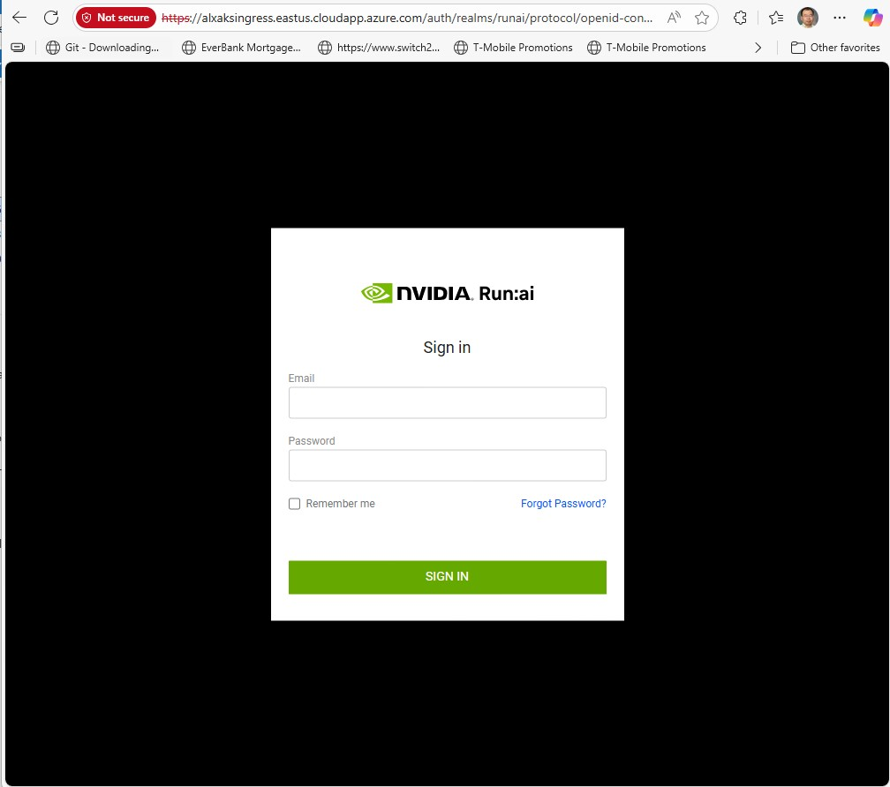
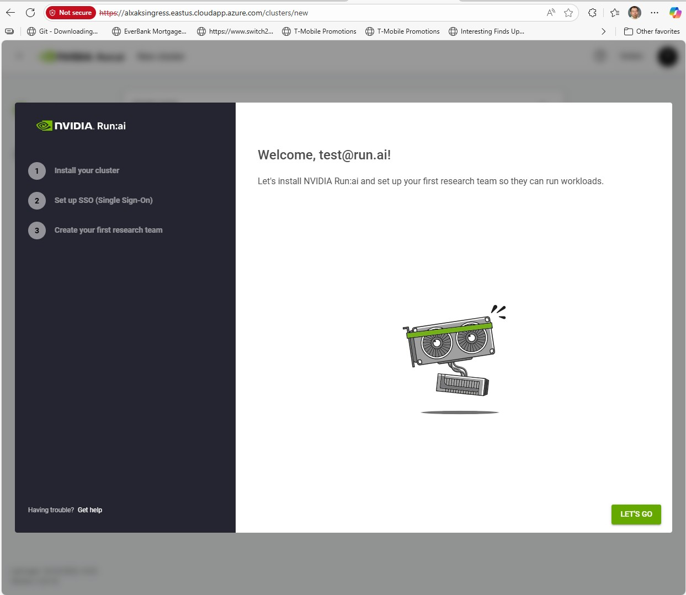

# Run.AI on AKS


## Create name space
```
kubectl create namespace runai-backend
```

## Create ingress controller

```
helm repo add ingress-nginx https://kubernetes.github.io/ingress-nginx
helm repo update
helm install nginx-ingress ingress-nginx/ingress-nginx --namespace nginx-ingress --create-namespace
    --set controller.service.annotations."service\.beta\.kubernetes\.io/azure-load-balancer-health-probe-request-path"=healthz
```
Using the Azure Portal:
Sign in to the Azure portal.
In the search box at the top, type "Load balancer" and select Load balancers from the search results.
Select your specific load balancer: from the list.
In the load balancer's settings menu, under Settings, select Health probes.
Select the existing health probe: you want to modify, or select + Add to create a new one.
In the "Add health probe" or "Edit health probe" pane, locate the Path field. This is where you can view or change the URI used for the health probe request.
Enter or modify the desired URI: (e.g., /, /healthz, /api/health).
Select Add or Save: to apply the changes.

# find the public IP
```
kubectl get svc -A
```
# find the public IP name 
az network public-ip list -g mc_jwu-rdma-test_jwu-ib-aks-cluster_eastus --query "[?ipAddress=='4.246.238.138'].name" -o tsv

# Add DNS Label
```
az network public-ip update --dns-name alxaksingress -g mc_jwu-rdma-test_jwu-ib-aks-cluster_eastus -n kubernetes-a570c7c60bf3c411ba5dbd794ad88a33 --allocation-method Static
az network public-ip show   --resource-group mc_jwu-rdma-test_jwu-ib-aks-cluster_eastus   --name kubernetes-a0292aee14dd64b729ca8253dbb52a5c
```
## Create a Cert

```
openssl req -x509 -newkey rsa:4096 -sha256 -days 365 -nodes -keyout alxaksingress.eastus.cloudapp.azure.com.key -out alxaksingress.eastus.cloudapp.azure.com.crt -subj "/CN=alxaksingress.eastus.cloudapp.azure.com" -addext "subjectAltName=DNS:alxaksingress.eastus.cloudapp.azure.com,DNS:*.alxaksingress.eastus.cloudapp.azure.com,IP:4.246.238.138" 
```

## Create a K8 secret for TLS
  ```
kubectl create secret tls runai-backend-tls -n runai-backend --cert=alxaksingress.eastus.cloudapp.azure.com.crt --key=alxaksingress.eastus.cloudapp.azure.com.key
  ```

##

kubectl create secret docker-registry runai-reg-creds  \
--docker-server=https://runai.jfrog.io \
--docker-username=self-hosted-image-puller-prod \
--docker-password=<TOKEN> \
--docker-email=support@run.ai \
--namespace=runai-backend

## Install the Control Plane
```
helm repo add runai-backend https://runai.jfrog.io/artifactory/cp-charts-prod
helm repo update
helm upgrade -i runai-backend -n runai-backend runai-backend/control-plane --set global.domain=alxaksingress.eastus.cloudapp.azure.com
```

## Login

https://lxaksingress.eastus.cloudapp.azure.com
default user is: test@run.ai and default password is Abcd!234




# Reference

https://run-ai-docs.nvidia.com/self-hosted/getting-started/installation/cp-system-requirements
https://docs.azure.cn/en-us/aks/app-routing-configuration
https://learn.microsoft.com/en-us/azure/aks/app-routing?tabs=without-osm#enable-web-application-routing-via-the-azure-cli
https://learn.microsoft.com/en-us/troubleshoot/azure/azure-kubernetes/load-bal-ingress-c/create-unmanaged-ingress-controller?tabs=azure-cli


